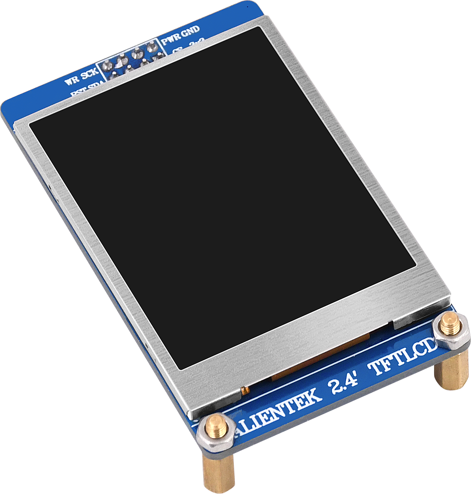
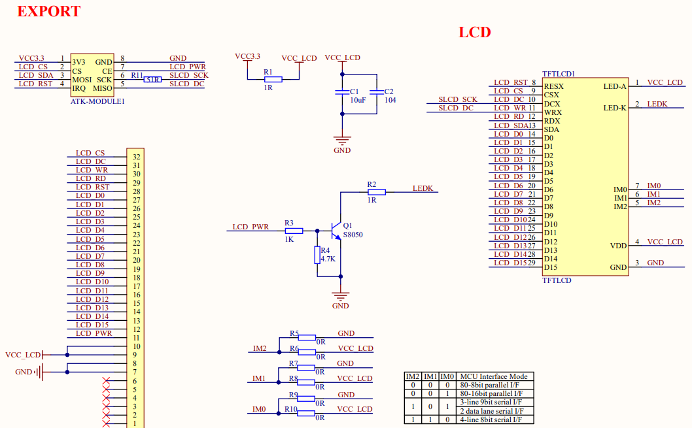

## 1 Introduction

### 1.1 Appearence

The ATK-MD0240 module looks like this:

### 1.2 Features

The ATK-MD0240 module is a high-performance 2.4 inch LCD display module launched by ALIENTEK. The LCD resolution of this module is as high as 320 * 240 pixels, supporting 16 bit true color display. The module uses ST7789 as the LCD driver chip, which comes with RAM and does not require additional drivers or memory. The external main control chip only needs to use SPI and 8080 interfaces to easily drive the ATK-MD0240 module.

### 1.3 Parameter

Here are the product basic parameters: 
| Parameter                  | Describe                           |
| -------------------------- | ---------------------------------- |
| Communication Interface    | Four-wire SPI/8080-16 bit parallel port |
| Color Format               | RGB565                             |
| Color Depth                | 16-bit                             |
| LCD Driver chip            | ST7789                            |
| LCD Resolution             | 320* 240                        |
| Screen Size                | 2.4 inch                         |
| View Direction             | Full viewing Angle                 |
| Operating Temperature      | -20℃ ~ 70℃                       |
| Storage Temperature        | -30℃ ~ 80℃                       |
| Mudule Size                | 72mm*43.65mm        |

The electrical parameters are shown in the following table:

| Parameter                  | Describe                           |
| -------------------------- | ---------------------------------- |
| Supply voltage             | 3.3V                               |
| IO port level              | 3.3V                               |
| Power dissipation          | 50mA(max)                          |
| VOH              | 2.64V(Min)                         |
| VOL              | 0.66V(Max)                         |
| VIH              | 2.64V(Min)                         |
| VIL              | 0.66V(Max)                         |

### 1.4 Interface

**1.Four-wire SPI**

The ATK-MD0240 module is connected to the external circuit through a 2 * 4 pin (2.54mm spacing). The detailed description of each pin is shown in the table below.

| Number    | Name         | Describe                                                                |
| --------- |------------- | -----------------------------------------------------------             |
| 1         | 3V3          | 3V3 power supply                                                        |
| 2         | CS           | SPI communication chip selection signal (effective low level)           |
| 3         | SDA          | SPI communication MOSI signal line                                      |
| 4         | RST          | Hardware reset pin (low level valid)                                    |
| 5         | WR           | Write command/data signal line (low: write command; High: Write data)   |
| 6         | SCK          | SPI communication SCK signal line                                       |
| 7         | PWR          | LCD backlight control pin (low: off; High level: On)                    |
| 8         | GND          | Power ground                                                            |

**2.8080-16 bit parallel port**

The ATK-MD0240 module is connected to the external circuit through a 32 Pin FPC socket. The detailed description of each pin is shown in the table below.

| Number | Name   | Describe                                                     |
| ------ | ------ | ------------------------------------------------------------ |
| 1~6    | NC     | NC                                                           |
| 7~8    | GND    | Power ground                                                 |
| 9~10   | 3V3    | 3V3 power supply                                             |
| 11     | PWR    | LCD backlight control pin (low: off; High level: On)         |
| 12~27  | D0~D15 | Data bus                                                     |
| 28     | RST    | Hardware reset pin (low level valid)                         |
| 29     | RD     | Read enable signal (effective at low level)                  |
| 30     | WR     | Write enable signal (effective at low level)                 |
| 31     | DC     | Write command/data signal line (low: write command; High: Write data) |
| 32     | CS     | SPI communication chip selection signal (effective low level) |

## 2 Schematic

The schematic diagram of the ATK-MD0240 module is shown as follows.

